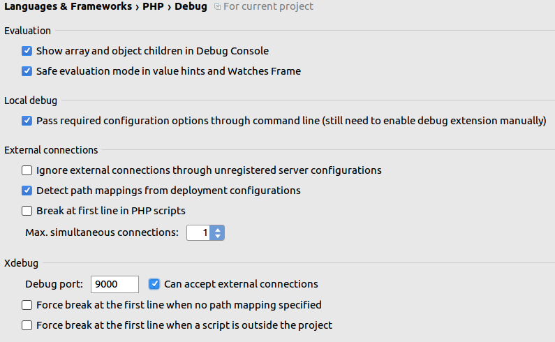
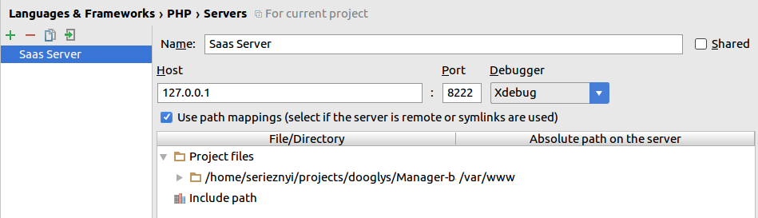
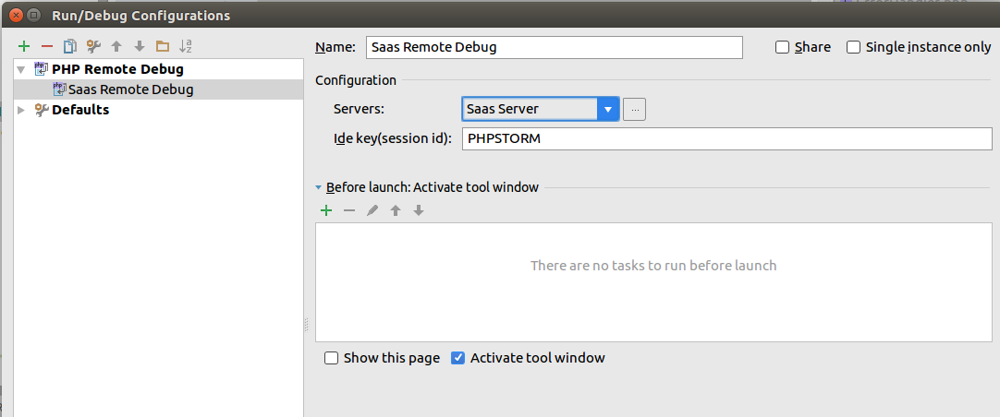

#Использование Xdebug в IDE PHPStorm

1. Запускаем приложение в Develop окружении

  `docker-compose up -d`

2. Настраиваем XDebug

  Путь `File -> Settings -> Languages & Frameworks -> PHP -> Debug`

  

3. Создаем `PHP Remote Debug` сервер со следующими параметрами

  Путь `File -> Settings -> Languages & Frameworks -> PHP -> Servers`

  

4. Создаем Debug конфигурацию

  Путь: `Run -> Edit Configurations`

  

5. **Важно** - в файле `docker/php/xdebug.ini` поменять ip адрес на адрес хостовой машины (для docker-toolbox). Например
`xdebug.remote_host=192.168.0.102`

  ***Linux***
  Выполняем команду `ifconfig` и смотрим IP адрес хоста `docker0`

# Проблемы 

1) Если режим Debug останавливается в начале файла, то выключите эту функцию в
Run -> Break at first line in PHP Script и убедитесь, что ваш Xdebug настроен как 
показано на [изображении](./images/xdebug-1.png)
