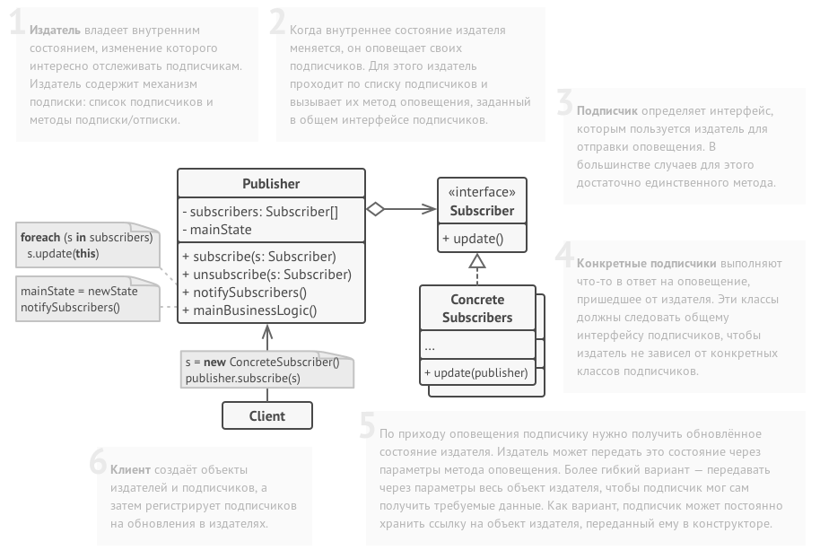

# Observer (Наблюдатель)

Определяет отношение "один-ко-многим" между объектами таким образом, что при изменении 
состояния одного объекта происходит автоматическое оповещение и обновление всех 
зависимых объектов



##### Реализация

```java

public interface Listener {
	public void update(int value);
}

public interface Publisher {
	public void registerListener(Listener l);
	public void notifyAll();
}

public class SimpleListener implements Listener {
	public void update(int value) {
		System.out.println("New value: " + value);
	}
}

public class SimplePublisher implements Publisher {
	private ArrayList<Listener> listeners = new ArrayList<Listener>();
	private int value = 0;
	
	public void register(Listener l) {
		listeners.add(l);
	}
	
	public void notifyAll() {
		for (Listener listener : listeners) {
			listener.update(value);
		}
	}
	
	public void setValue(int value) {
		this.value = value;
		notifyAll();
	}
}

public class Main {

	public static void main(String[] args) {
		SimplePublisher simplePublisher = new SimplePublisher();
		SimpleListener simpleListener = new SimpleListener();
		simplePublisher.registerObserver(simpleListener);

		simplePublisher.setValue(80);
	}
}
```

##### Еще реализации данного паттерна

* `java.util.Observable` и `java.util.Observer`
