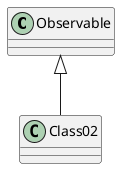

# Observer (Наблюдатель)

Определяет отношение "один-ко-многим" между объектами таким образом, что при изменении 
состояния одного объекта происходит автоматическое оповещение и обновление всех 
зависимых объектов



##### Реализация

```java
```

##### Советы

* 

##### Еще реализации данного паттерна

* `java.util.Observable` и `java.util.Observer`
