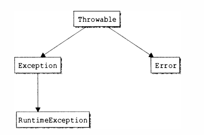

# Обработка исключений

> Ключевые слова
> `try`, `catch`, `throw`, `throws`, `finally`

# Иерархия исключений



 - Exception - ошибки прикладной программы. После возникновения штатное выполнение программы возможно. 
 - Error - ошибки уровня виртуальной машины. После возникновения штатное выполнение программы невозможно. 

# Throws

```java

void function testException() throws MyException
{
   ...
}

```

 - Не перехватываемые исключения - Erorr и все производные от него; RuntimeException и все производные от него
 - Перехватываемые - Throwable и Exception исключая не перехватываемые

**Заметки**
* В throws прописываются все выбрасываемые исключения, кроме тех, которые наследуются от `Error` и `RuntimeException`

## Пример использования блока исключений

```java

try {
  ...
} catch (Exception exception) {
  ...
} catch (RuntimeException exception) {
  ...
} finally {
  ...
}

```

**Заметки**
* catch будут перехватывать исключения в порядке объявления
* Применяя несколько операторов catch, важно помнить, что перехват исключений из подклассов должен следовать до перехвата исключений из суперклассов

## Управление ресурсами с помощью try (>= JDK 7 )

```java
try (java.io.AutoCloseabe resource1 = new SomeStream(); java.io.AutoCloseabe resource2 = new SomeStream();) {
   
} 
```

**Заметки**
* Что бы использовтаь ресурс в блоке try - он должен реализовывать интерфейс `java.io.AutoCloseabe`
